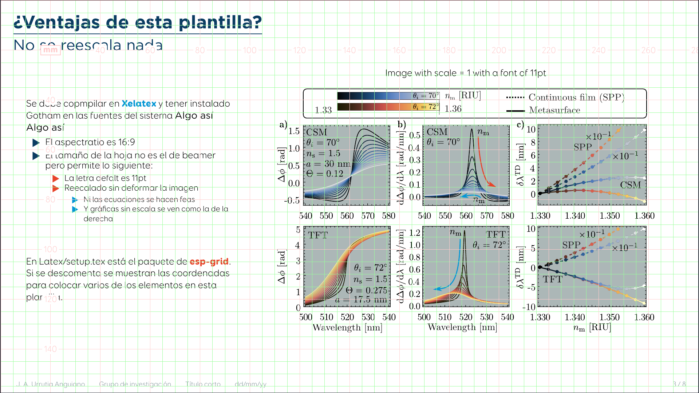

# Beamer-Facultad-Ciencias-UNAM
Plantilla basada en la identidad gráfica de la Facultad de Ciencias

## Links

-  Identidad gráfica de la  [FC, UNAM](https://www.fciencias.unam.mx/sites/default/files/2020-10/Manual-Identidad-Visual-FC-2020.pdf)

## Visualización

*Visualización mediante [Converting PDF slides to animated GIFs and videos with ImageMagick](http://phyletica.org/imagemagick/) por [Jamie Oaks](http://github.com/joaks1).*

Descomentando el paquete 'eso-grid' en [Latex/setup.tex](Latex/setup.tex), se muestran las coordenadas de la página

